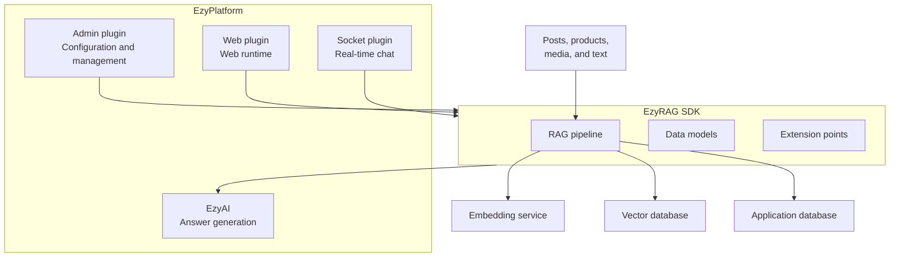
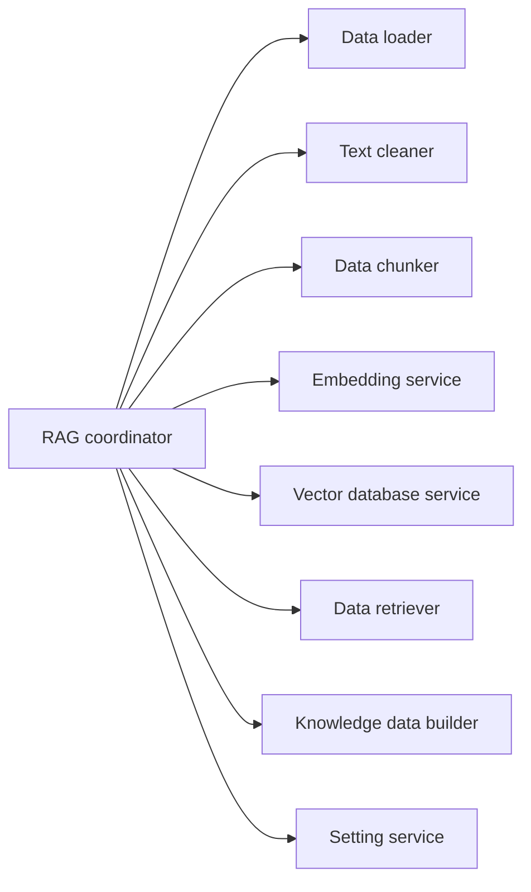
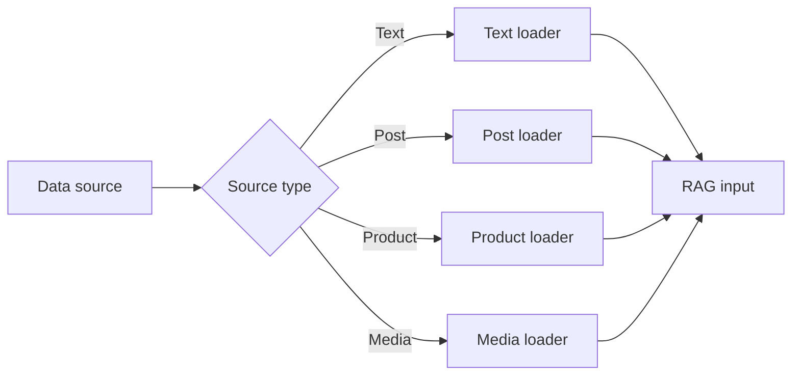
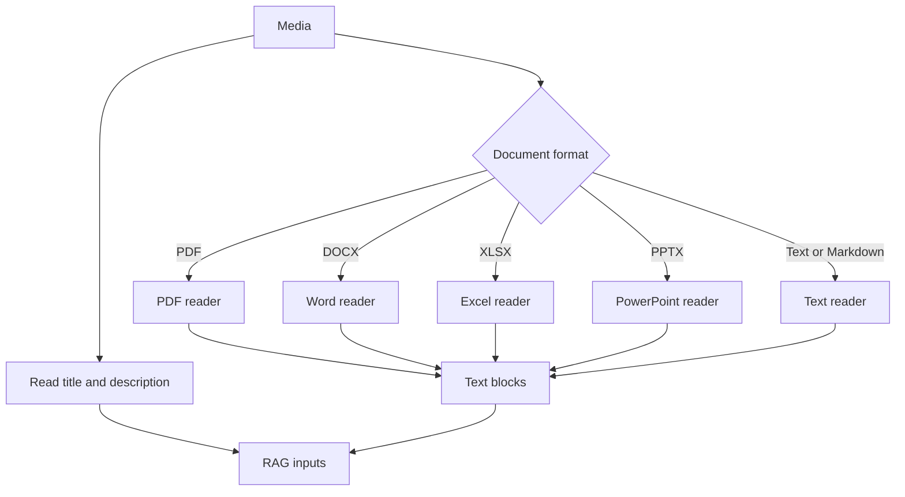
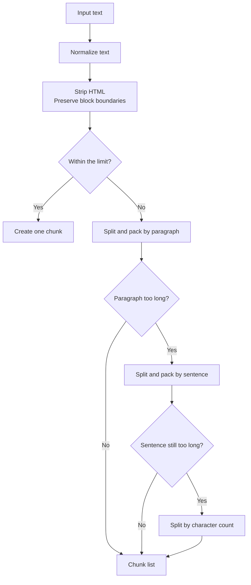
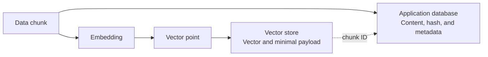
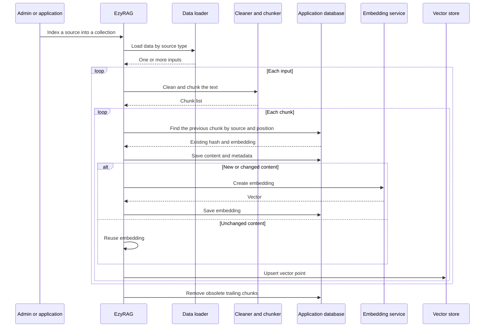
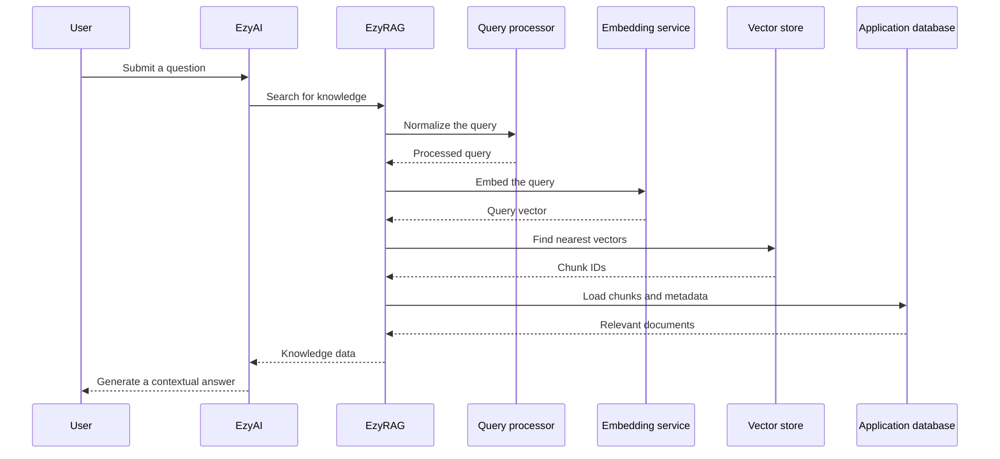
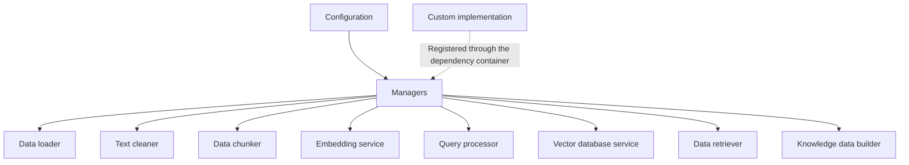
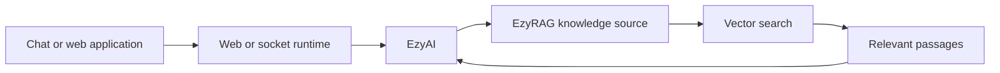

EzyRAG is the knowledge-retrieval layer for the EzyPlatform ecosystem. It ingests website content, turns that content into vectors for semantic search, and supplies relevant passages to EzyAI or other AI components.

EzyRAG focuses on the **Retrieval** part of Retrieval-Augmented Generation. Calling a language model and generating the final answer are EzyAI responsibilities.

# Overall architecture

EzyRAG consists of four main modules:

- The **core SDK** defines shared data models, abstractions, and RAG pipelines.
- The **admin plugin** provides configuration and data-management features.
- The **web plugin** makes RAG components available in the web runtime.
- The **socket plugin** connects the RAG knowledge source to EzyAI and real-time chat flows.

# Core SDK

The SDK coordinates two primary flows: indexing data and retrieving knowledge. Each runtime plugin supplies environment-specific dependencies, while the processing contracts and algorithms remain shared.

# Data sources and loaders

A data loader converts each source type into a common textual input for the pipeline.

| Source | Indexed content | Attached metadata |
|---|---|---|
| Direct text | Text entered by an administrator | Request metadata |
| Post | Title and body | Title, slug, excerpt |
| Product | Name, codes, description, and localized content | Name, slug, product code, price, currency |
| Media | Descriptive fields and document content | Title, resource URL |

A source can produce multiple inputs. For example, a localized product can yield one input for its default content and additional inputs for its translations.

# Document readers

For media sources, EzyRAG selects a reader by MIME type or file extension. Supported formats include PDF, Word `.docx`, Excel `.xlsx`, PowerPoint `.pptx`, plain text, and Markdown.

# Text cleaning and chunking

The text cleaner normalizes Unicode, line endings, and whitespace. It also removes unnecessary control characters and repeated blank lines.

The chunker uses a hierarchical strategy. HTML is converted to text while preserving meaningful block boundaries where possible. Content is then split by paragraphs, sentences, and finally character count when no suitable natural boundary remains.

The chunk limit, paragraph separator, and sentence-boundary expression are configurable. The current algorithm limits chunks by character count rather than model tokens.

# Embedding service

The embedding service turns content or queries into numeric vectors. The current implementation supports OpenAI with a configurable embedding model. The target collection determines the required vector size.

The service sits behind an interface and manager, so another provider can be added without changing the main pipeline.

# Vector databases and collections

EzyRAG currently provides adapters for two vector stores:

- EzyVector.
- Qdrant.

The vector database service supports creating collections, upserting and deleting points, and nearest-vector search. A collection records its name, vector database service, vector size, and operational status. Each vector database service can have a default collection.

# Chunk and metadata storage

EzyRAG separates business content from vector storage:

- The vector store contains vectors, chunk IDs, and the minimal payload needed for search.
- The application database contains chunk content, hashes, embeddings, and metadata.

Metadata can include a title, slug, excerpt, resource URL, product code, price, and currency. After vector search, EzyRAG uses chunk IDs to load the complete content and metadata.

# Indexing pipeline

Each chunk receives a content hash. For sources with stable identifiers, EzyRAG reuses the existing embedding when the hash has not changed. Direct text input currently creates new chunks instead of looking up embeddings by source and position.

When a new version has fewer chunks, obsolete chunks are deleted from the application database. This indexing flow does not show matching deletion of obsolete vector points from the vector database, which is an important synchronization consideration.

# Search pipeline

The query is normalized, embedded, and searched against a collection. Vector results identify matching chunks; the data retriever loads their content and metadata, and the knowledge builder converts them into data understood by EzyAI.

If the request does not specify a vector service or collection, EzyRAG uses the configured defaults. If the configuration or collection is unavailable, the knowledge source returns an empty list.

# Data retriever and knowledge builder

The data retriever uses IDs from vector search results to load chunks and metadata from the application database. The knowledge builder then converts those documents into EzyAI's knowledge structure.

In addition to vector search, the knowledge source can retrieve content directly by source type and ID or code. When a source has multiple chunks, they are merged in order to reconstruct its full content.

# Configuration and extensibility

Each primary pipeline stage is managed through an interface and manager:

- Data loader.
- Text cleaner.
- Data chunker.
- Embedding service.
- Query processor.
- Vector database service.
- Data retriever.
- Knowledge data builder.

This design allows individual components to be replaced independently, such as adding a vector database, embedding provider, or chunking strategy.

# Admin, web, and socket plugins

The admin plugin provides UI and APIs for configuring embedding, vector databases, chunking, collections, and default implementations. It also supports indexing sources, inspecting chunks, and testing search.

The web plugin registers the repositories, services, loaders, readers, and adapters required by the web runtime. The socket plugin publishes the knowledge source and search strategy that EzyAI uses in real-time chat flows.

The socket plugin does not expose a separate RAG protocol to clients. It supplies an internal knowledge source used by the EzyAI infrastructure.

# Responsibility boundary

EzyRAG is responsible for loading data, cleaning and chunking content, creating embeddings, storing vectors, searching, and returning relevant context.

EzyRAG does not train language models, manage conversations, or generate final answers. Those responsibilities belong to EzyAI and the integrating application.

