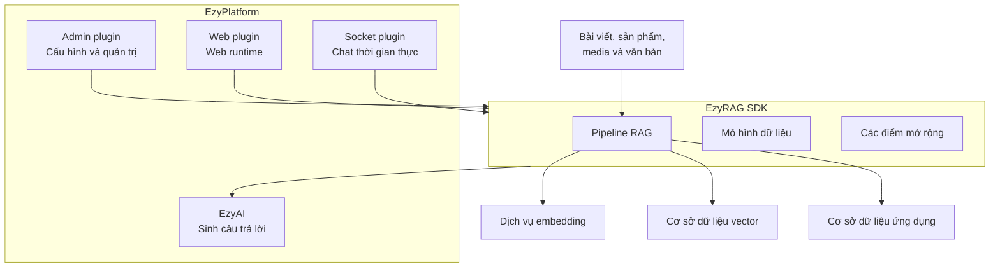
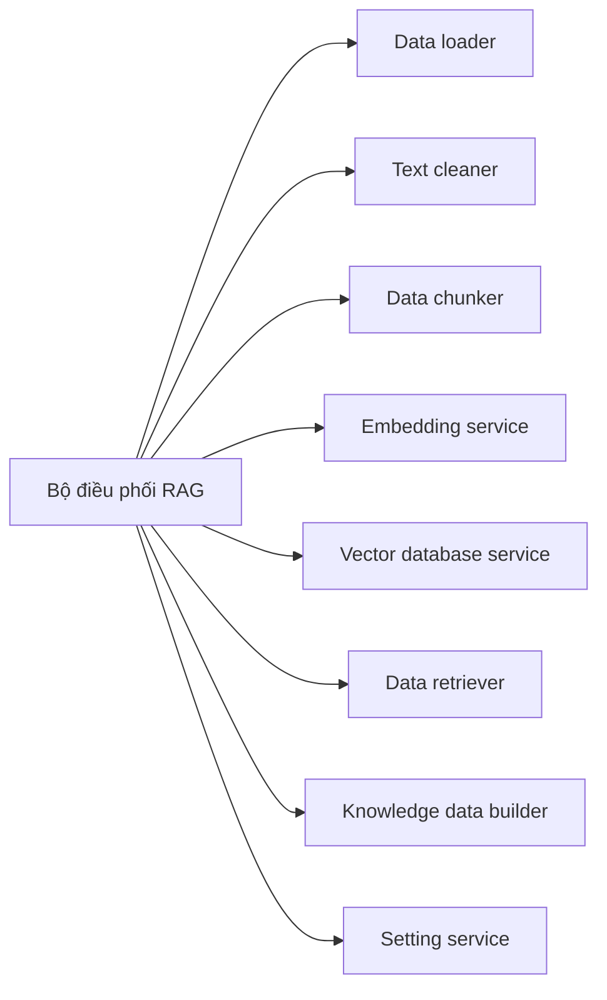
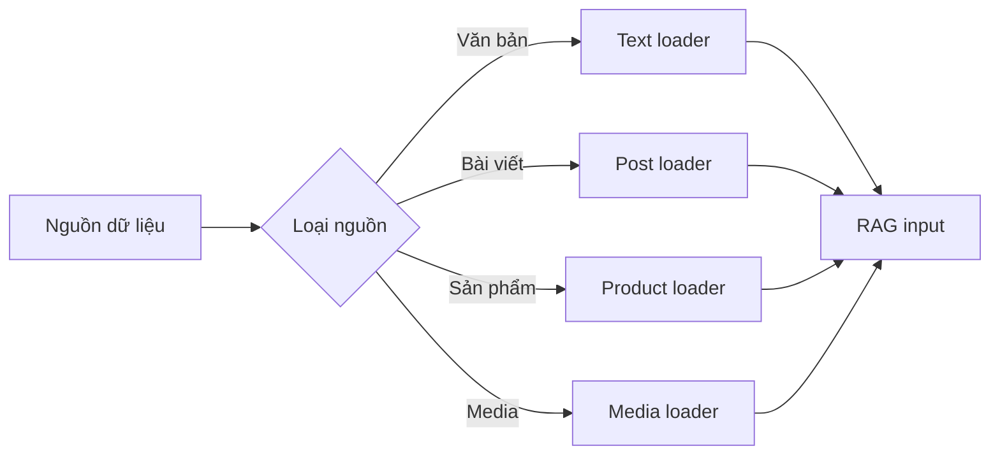
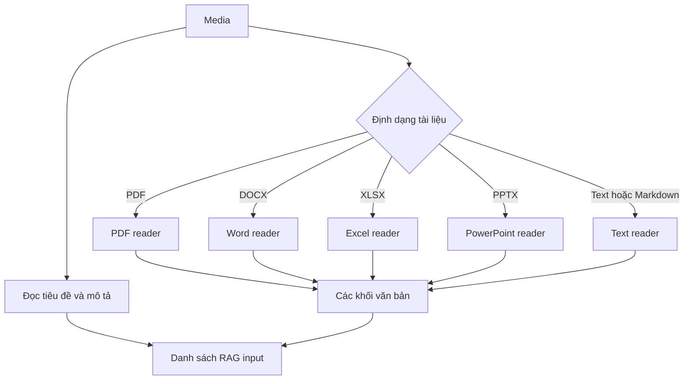
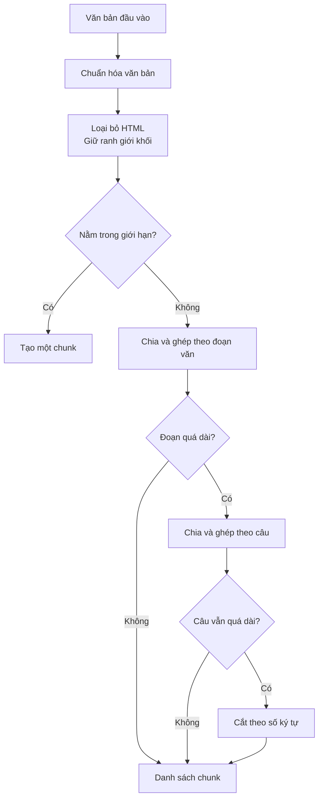
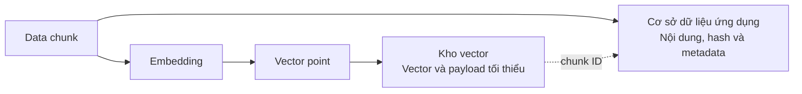
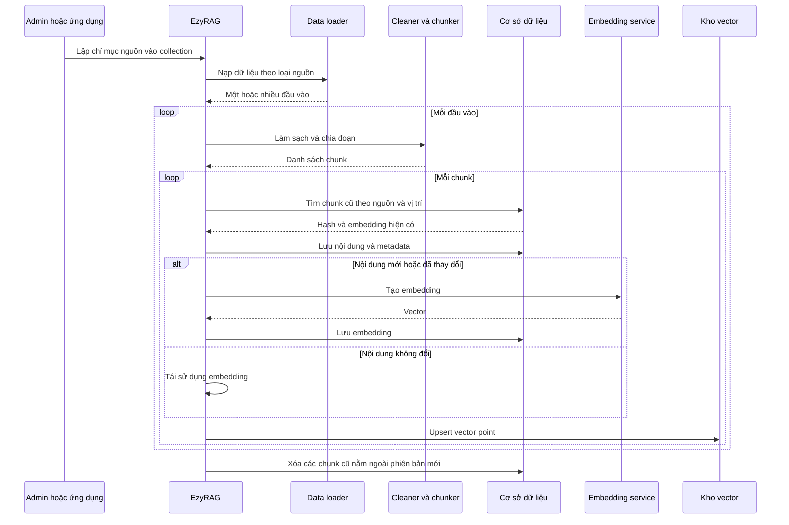
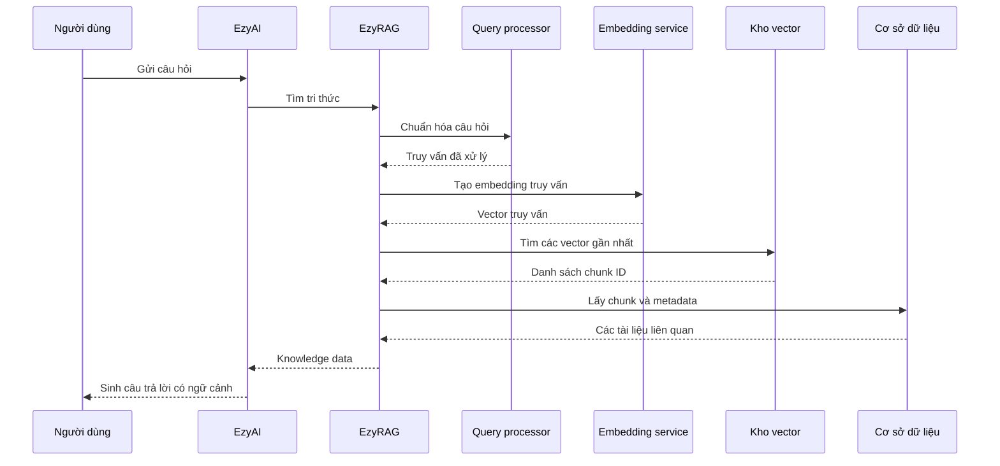
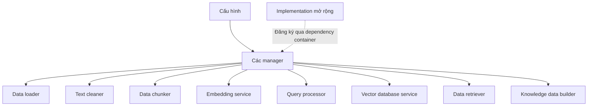
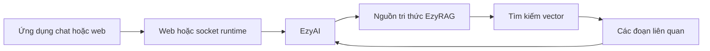

EzyRAG là lớp truy hồi tri thức dành cho hệ sinh thái EzyPlatform. Hệ thống tiếp nhận nội dung của website, chuyển nội dung thành vector để tìm kiếm theo ngữ nghĩa, sau đó cung cấp các đoạn liên quan cho EzyAI hoặc thành phần AI khác.

EzyRAG tập trung vào phần **Retrieval** của Retrieval-Augmented Generation. Việc gọi mô hình ngôn ngữ và sinh câu trả lời cuối cùng thuộc trách nhiệm của EzyAI.

# Kiến trúc tổng thể

EzyRAG gồm bốn module chính:

- **SDK lõi** định nghĩa mô hình dữ liệu, các abstraction và pipeline RAG dùng chung.
- **Admin plugin** cung cấp chức năng cấu hình và quản trị dữ liệu.
- **Web plugin** đưa các thành phần RAG vào web runtime.
- **Socket plugin** kết nối nguồn tri thức RAG với EzyAI và luồng chat thời gian thực.

# SDK lõi

SDK điều phối hai luồng chính: lập chỉ mục dữ liệu và tìm kiếm tri thức. Những thành phần phụ thuộc môi trường được cung cấp bởi từng plugin, trong khi thuật toán và hợp đồng xử lý được dùng chung.

# Nguồn dữ liệu và bộ nạp

Data loader chuyển từng loại nguồn thành đầu vào văn bản thống nhất cho pipeline.

| Nguồn | Nội dung được lập chỉ mục | Metadata đi kèm |
|---|---|---|
| Văn bản trực tiếp | Nội dung do người quản trị nhập | Metadata của yêu cầu |
| Bài viết | Tiêu đề và nội dung | Tiêu đề, slug, tóm tắt |
| Sản phẩm | Tên, mã, mô tả và nội dung đa ngôn ngữ | Tên, slug, mã sản phẩm, giá, tiền tệ |
| Media | Thuộc tính mô tả và nội dung tài liệu | Tiêu đề, URL tài nguyên |

Một nguồn có thể sinh nhiều đầu vào. Ví dụ, sản phẩm đa ngôn ngữ có thể tạo một đầu vào cho nội dung mặc định và các đầu vào tiếp theo cho từng bản dịch.

# Bộ đọc tài liệu

Với nguồn media, hệ thống chọn bộ đọc theo MIME type hoặc phần mở rộng của tệp. Các định dạng được hỗ trợ gồm PDF, Word `.docx`, Excel `.xlsx`, PowerPoint `.pptx`, văn bản thuần và Markdown.

# Làm sạch và chia đoạn

Text cleaner chuẩn hóa Unicode, kiểu xuống dòng và khoảng trắng; đồng thời loại bỏ các ký tự điều khiển không cần thiết và dòng trống lặp lại.

Chunker sử dụng chiến lược phân cấp. HTML được chuyển thành văn bản nhưng vẫn cố gắng giữ các ranh giới có ý nghĩa. Nội dung sau đó được chia theo đoạn văn, theo câu và cuối cùng theo số ký tự nếu không còn ranh giới tự nhiên phù hợp.

Giới hạn chunk, dấu phân cách đoạn và biểu thức nhận biết ranh giới câu đều có thể cấu hình. Thuật toán hiện giới hạn theo số ký tự, không phải số token.

# Dịch vụ embedding

Embedding service chuyển nội dung hoặc câu hỏi thành vector số. Triển khai hiện tại hỗ trợ OpenAI và cho phép cấu hình model. Kích thước vector được lấy từ collection đích.

Embedding service được đặt sau một interface và manager, vì vậy có thể bổ sung nhà cung cấp khác mà không thay đổi pipeline chính.

# Cơ sở dữ liệu vector và collection

EzyRAG hiện có adapter cho hai hệ thống lưu trữ vector:

- EzyVector.
- Qdrant.

Vector database service cung cấp các thao tác tạo collection, upsert, xóa point và tìm kiếm vector gần nhất. Collection lưu tên, dịch vụ vector, kích thước vector và trạng thái hoạt động. Mỗi dịch vụ vector có thể có một collection mặc định.

# Kho chunk và metadata

EzyRAG tách nội dung nghiệp vụ khỏi kho vector:

- Kho vector giữ vector, ID chunk và payload tối thiểu phục vụ tìm kiếm.
- Cơ sở dữ liệu ứng dụng giữ nội dung, hash, embedding và metadata của chunk.

Metadata có thể chứa tiêu đề, slug, tóm tắt, URL tài nguyên, mã sản phẩm, giá và đơn vị tiền tệ. Sau khi tìm kiếm vector, hệ thống dùng ID chunk để đọc lại nội dung và metadata đầy đủ.

# Pipeline lập chỉ mục

Mỗi chunk được tính hash từ nội dung. Với nguồn có định danh ổn định, hệ thống tái sử dụng embedding khi hash không đổi. Văn bản nhập trực tiếp hiện tạo chunk mới thay vì tìm lại embedding theo nguồn và vị trí.

Khi phiên bản mới có ít chunk hơn, các chunk dư được xóa khỏi cơ sở dữ liệu ứng dụng. Luồng này không thể hiện việc xóa đồng thời các vector point dư khỏi vector database, vì vậy đây là điểm cần lưu ý khi đồng bộ dữ liệu.

# Pipeline tìm kiếm

Câu hỏi được chuẩn hóa, chuyển thành embedding và tìm kiếm trong collection. Kết quả vector chỉ ra các chunk phù hợp; data retriever đọc nội dung và metadata từ cơ sở dữ liệu, sau đó knowledge builder chuyển chúng thành dữ liệu tri thức cho EzyAI.

Nếu dịch vụ vector hoặc collection không được truyền vào truy vấn, hệ thống dùng cấu hình mặc định. Nếu cấu hình hoặc collection không tồn tại, nguồn tri thức trả về danh sách rỗng.

# Data retriever và knowledge builder

Data retriever dùng ID từ kết quả tìm kiếm vector để lấy chunk và metadata trong cơ sở dữ liệu ứng dụng. Knowledge builder sau đó chuyển tài liệu thành cấu trúc mà EzyAI hiểu được.

Ngoài tìm kiếm vector, nguồn tri thức còn hỗ trợ lấy nội dung trực tiếp theo loại nguồn và ID hoặc mã. Khi một nguồn có nhiều chunk, chúng được ghép theo thứ tự để tái tạo nội dung đầy đủ.

# Cấu hình và khả năng mở rộng

Các giai đoạn chính đều được quản lý qua interface và manager:

- Data loader.
- Text cleaner.
- Data chunker.
- Embedding service.
- Query processor.
- Vector database service.
- Data retriever.
- Knowledge data builder.

Thiết kế này cho phép thay thế từng thành phần độc lập, chẳng hạn bổ sung vector database, nhà cung cấp embedding hoặc chiến lược chunking mới.

# Admin, web và socket plugin

Admin plugin cung cấp giao diện và API để cấu hình embedding, vector database, chunking, collection và các implementation mặc định. Plugin cũng hỗ trợ lập chỉ mục nguồn dữ liệu, xem chunk và thử tìm kiếm.

Web plugin đăng ký các repository, service, loader, reader và adapter cần thiết cho web runtime. Socket plugin công bố nguồn tri thức và search strategy để EzyAI sử dụng trong luồng chat thời gian thực.

Socket plugin không tạo một giao thức RAG độc lập cho client; nó cung cấp nguồn tri thức để hạ tầng EzyAI gọi nội bộ.

# Ranh giới trách nhiệm

EzyRAG chịu trách nhiệm nạp dữ liệu, làm sạch, chia đoạn, tạo embedding, lưu vector, tìm kiếm và trả về ngữ cảnh liên quan.

EzyRAG không huấn luyện mô hình ngôn ngữ, không quản lý hội thoại và không sinh câu trả lời cuối cùng. Các trách nhiệm đó thuộc về EzyAI và ứng dụng tích hợp.

