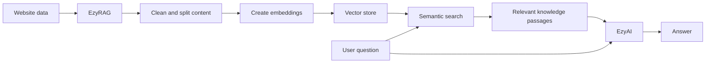
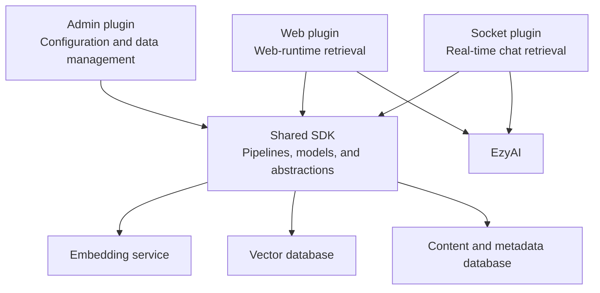
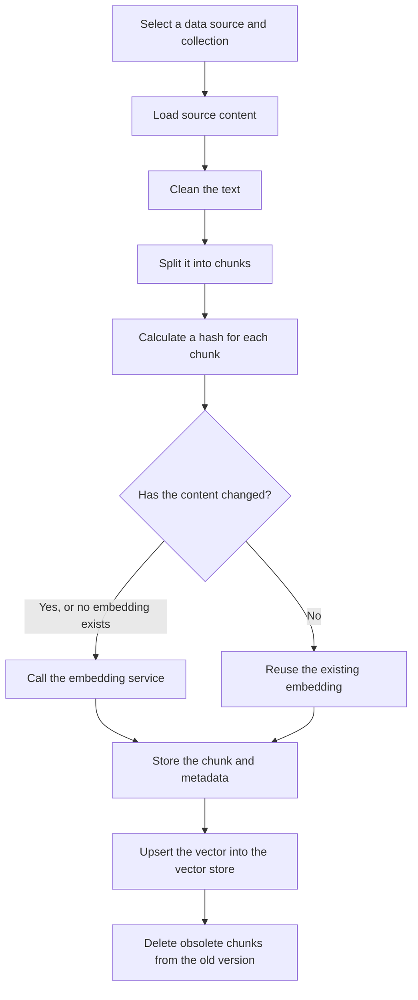
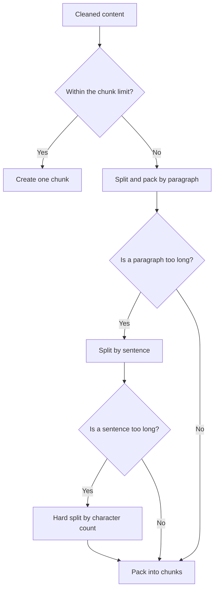
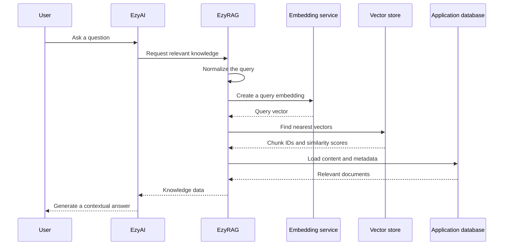

# Introducing EzyRAG

When a website has accumulated hundreds of articles, products, and documents, the challenge is no longer a lack of content. It is the ability to find the right information by meaning. Traditional keyword search usually works only when users enter the same phrases that appear in the data. AI applications need a more flexible retrieval layer capable of finding semantically relevant passages.

EzyRAG addresses this problem within the EzyPlatform ecosystem. It turns website content into a knowledge base that can be searched using vectors, then supplies the retrieved information to EzyAI or other AI components.

EzyRAG focuses on the **Retrieval** part of Retrieval-Augmented Generation. It prepares data, creates embeddings, and retrieves knowledge. Generating the final answer with a language model remains the responsibility of EzyAI.

# What problem does EzyRAG solve?

A language model does not automatically know the private content of a particular website. If a question is sent directly to the model, its answer may be outdated, may not reflect the organization's actual data, or may contain unsupported assumptions.

RAG adds a retrieval step before answer generation:

1. Website content is split into smaller passages.
2. Each passage is represented as an embedding vector.
3. The user's question is also converted into a vector.
4. The system finds passages whose vectors are closest to the question.
5. The relevant passages are passed to the language model as context.

EzyRAG implements the workflow from data preparation to context delivery and integrates it with EzyPlatform's admin, web, and socket runtimes.

# High-level architecture

EzyRAG consists of four main parts:

- A **shared SDK** containing the core data models and processing pipelines.
- An **admin plugin** for configuration, collection management, data ingestion, and search inspection.
- A **web plugin** that makes knowledge retrieval available in the web runtime.
- A **socket plugin** that connects RAG knowledge retrieval to real-time chat.

This separation allows the same retrieval behavior to be reused consistently across runtimes. Environment-specific components, such as repositories, configuration services, and network clients, have corresponding admin, web, and socket implementations, while the core algorithms remain shared.

# Supported data sources

EzyRAG provides loaders for several common EzyPlatform content types:

- Articles, including their titles, content, slugs, and summaries.
- Products, including names, product codes, descriptions, translations, prices, and currencies.
- Uploaded media and documents.
- Text entered directly through the administration interface.

For document extraction, the project includes readers for:

- PDF;
- Microsoft Word `.docx`;
- Microsoft Excel `.xlsx`;
- Microsoft PowerPoint `.pptx`;
- plain text and Markdown.

In addition to searchable content, EzyRAG retains metadata such as titles, slugs, resource URLs, product codes, and prices. A retrieval result can therefore include enough information to create a link, identify a source, or present product details instead of returning only an isolated text passage.

# Data ingestion pipeline

When an administrator requests that a data source be indexed, EzyRAG runs a multi-stage pipeline.

## Loading content

A loader is selected according to the source type. This lets each source retrieve content and metadata in its own way without changing the remainder of of the pipeline.

An article may produce a single input item, while a multilingual product or large document may produce a sequence of inputs.

## Cleaning text

Before chunking, the text is normalized by:

- normalizing Unicode;
- unifying line endings;
- removing unnecessary control characters;
- compacting whitespace;
- limiting repeated blank lines.

When the input contains HTML, presentation markup is removed while meaningful boundaries such as paragraphs, headings, list items, and line breaks are preserved where possible. Content inside `script` and `style` elements is excluded from the knowledge data.

## Hierarchical chunking

EzyRAG applies a boundary-aware chunking strategy in the following order:

1. Pack content along paragraph boundaries.
2. If a paragraph is too long, split it at sentence boundaries.
3. If a sentence is still too long, split it by character count.

The maximum chunk length, paragraph separator, and sentence-boundary expression come from configuration. The strategy can therefore be tuned for different languages and content types without replacing the pipeline.

## Avoiding unnecessary embedding requests

EzyRAG calculates a content hash for each chunk. When the same source is indexed again, it compares the new hash with the stored data:

- If the content is unchanged and an embedding already exists, the embedding is reused.
- If the content has changed or no embedding exists, a new embedding is generated.
- If the new version contains fewer chunks, surplus chunks from the old version are removed from the application database.

This behavior reduces embedding-service calls when content is reindexed.

# Embeddings and vector storage

The current implementation creates embeddings through OpenAI. The embedding model is configurable, the input is currently text, and the requested vector dimensions come from the target collection.

Two vector database integrations are implemented directly in the current source code:

- **EzyVector**
- **Qdrant**

When a collection is created or updated, EzyRAG can ask the selected vector service to create its corresponding collection if it does not already exist. Qdrant collections use cosine distance, and their vector size is synchronized back into EzyRAG's collection configuration.

Storage is divided into two layers:

- The vector store keeps vectors, chunk identifiers, and a minimal search payload.
- The application database keeps full chunk content, metadata, and embedding information.

A vector search therefore only needs to return the matching identifiers. EzyRAG then loads their content and metadata from the application database to build complete knowledge documents.

# Knowledge retrieval flow

Retrieval starts with the user's question:

1. The query is normalized by trimming and compacting whitespace.
2. The embedding service converts the query into a vector.
3. The vector database finds the nearest points in the selected collection.
4. EzyRAG loads the corresponding chunks from the application database.
5. Metadata is attached to each chunk.
6. The documents are converted to the knowledge model understood by EzyAI.

The vector service and collection may be specified in the search parameters. If omitted, EzyRAG uses the configured default service and default collection.

The knowledge source can also retrieve complete content by source type and identifier. Chunks that belong to the same source are joined in order to reconstruct the content for EzyAI.

# Administration and operations

The admin plugin provides the following capabilities:

- Select implementations for chunking, retrieval, and knowledge-data construction.
- Configure the embedding service and model.
- Configure EzyVector or Qdrant connections.
- Create, update, activate, and deactivate collections.
- Set a default collection for each vector service.
- Ingest articles, products, media, or text into a collection.
- Browse indexed chunks with pagination.
- Run test searches against the default collection.

The administration APIs require authentication and are scoped to the platform's RAG feature. Sensitive values such as API keys are handled through password-oriented configuration mechanisms instead of being embedded in source code.

# Extensibility

Each major pipeline stage is represented by an abstraction and a corresponding manager:

- data loader;
- text cleaner;
- data chunker;
- embedding service;
- query processor;
- vector database service;
- data retriever;
- knowledge data builder.

Developers can add and register alternative implementations without rewriting the complete RAG workflow. For example, the system can be extended with another embedding provider, a token-aware chunker, or a new vector database integration.

# EzyAI and real-time chat integration

EzyRAG exposes a knowledge source through the contract consumed by EzyAI. When EzyAI needs supporting context for a question, it calls this source, receives the relevant passages, and uses them during answer generation.

The socket plugin acts as a bridge for real-time chat. It does not expose a separate RAG protocol directly to clients. Instead, it makes the search strategy and knowledge source available for internal use by EzyAI in the socket runtime.

The responsibilities are clearly separated:

- EzyRAG manages content, embeddings, and retrieval.
- EzyAI coordinates the language model and generates answers.
- The web or chat application owns the user experience.

# When is EzyRAG a good fit?

EzyRAG is suitable for EzyPlatform websites that want to:

- build a chatbot grounded in their own content;
- search articles semantically;
- help customers discover products using natural language;
- turn uploaded documents into searchable knowledge;
- reuse a shared knowledge base across web and real-time chat;
- manage a RAG pipeline through the existing administration system.

It is particularly useful when the data already resides in EzyPlatform. Its loaders preserve relationships with articles, products, and media rather than treating all content as unrelated text files.

# Conclusion

EzyRAG is the knowledge-retrieval layer for EzyPlatform. It connects business data, text processing, embeddings, vector search, and EzyAI through a modular pipeline.

Instead of relying only on a language model's general knowledge, EzyRAG gives EzyAI access to the website's actual content at query time. This provides the foundation for semantic search and AI assistants whose answers are grounded in the system's real data.

