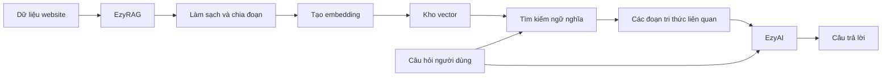
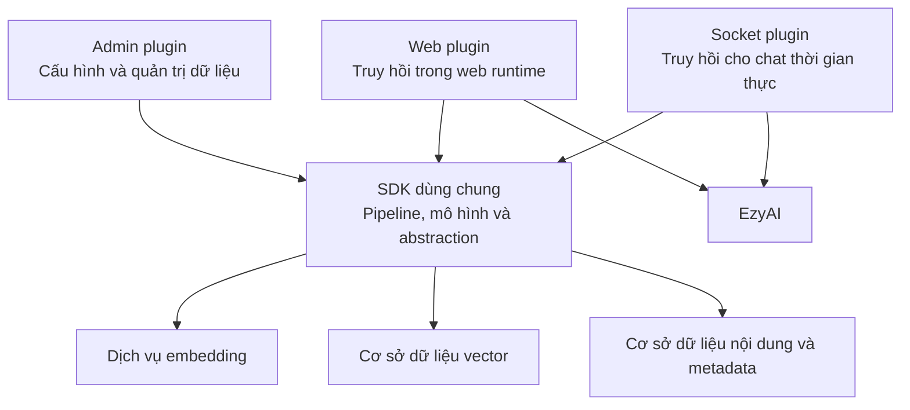
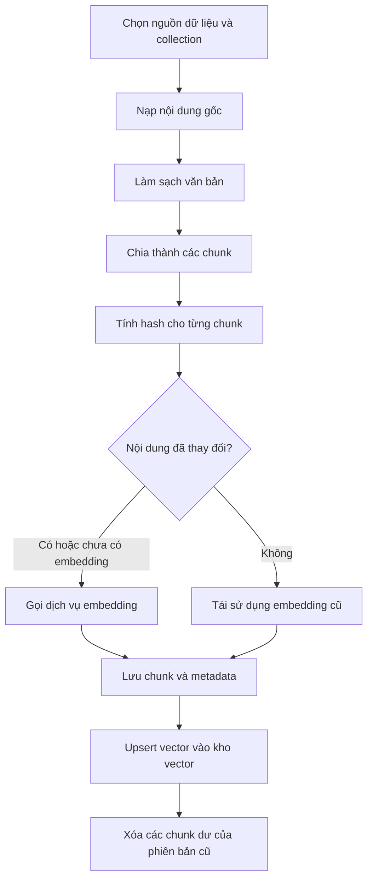
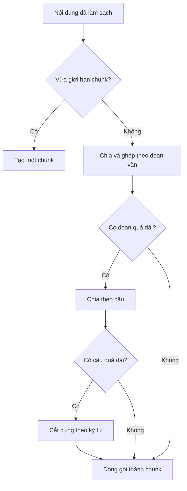
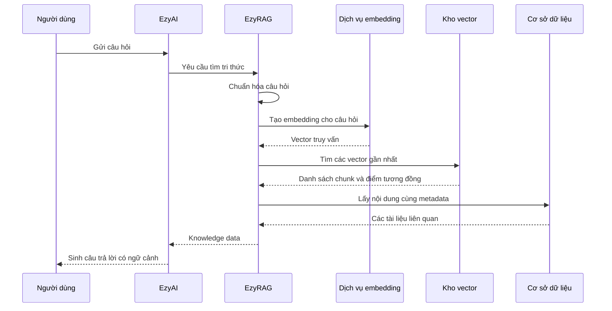

# Giới thiệu dự án EzyRAG

Khi một website đã tích lũy hàng trăm bài viết, sản phẩm và tài liệu, thách thức không còn nằm ở việc thiếu nội dung mà ở khả năng tìm đúng thông tin theo ý nghĩa. Tìm kiếm từ khóa truyền thống thường chỉ hiệu quả khi người dùng nhập đúng cụm từ xuất hiện trong dữ liệu. Trong khi đó, các ứng dụng AI cần một lớp truy hồi linh hoạt hơn để tìm ra những đoạn nội dung có liên quan về mặt ngữ nghĩa.

EzyRAG được xây dựng để giải quyết bài toán đó trong hệ sinh thái EzyPlatform. Dự án biến nội dung của website thành một kho tri thức có thể tìm kiếm bằng vector, sau đó cung cấp kết quả truy hồi cho EzyAI hoặc các thành phần AI khác sử dụng.

Điểm quan trọng là EzyRAG tập trung vào phần **Retrieval** trong mô hình Retrieval-Augmented Generation. Dự án chuẩn bị dữ liệu, tạo embedding và truy hồi tri thức; việc tổng hợp câu trả lời bằng mô hình ngôn ngữ thuộc trách nhiệm của EzyAI.

# EzyRAG giải quyết vấn đề gì?

Một mô hình ngôn ngữ không tự biết nội dung riêng của từng website. Nếu chỉ gửi câu hỏi trực tiếp cho mô hình, câu trả lời có thể thiếu thông tin mới nhất, không phản ánh đúng dữ liệu của doanh nghiệp hoặc thậm chí chứa thông tin được suy diễn.

RAG bổ sung một bước truy hồi trước khi sinh câu trả lời:

1. Nội dung của website được chuyển thành các đoạn văn bản nhỏ.
2. Mỗi đoạn được biểu diễn bằng một vector embedding.
3. Câu hỏi của người dùng cũng được chuyển thành vector.
4. Hệ thống tìm những đoạn có vector gần nhất với câu hỏi.
5. Các đoạn liên quan được chuyển cho mô hình ngôn ngữ làm ngữ cảnh.

EzyRAG hiện thực hóa các bước từ chuẩn bị dữ liệu đến cung cấp ngữ cảnh, đồng thời tích hợp chúng vào hạ tầng quản trị, web và socket của EzyPlatform.

# Kiến trúc tổng quát

EzyRAG được tổ chức thành bốn phần chính:

- **SDK dùng chung** chứa mô hình dữ liệu và các pipeline xử lý cốt lõi.
- **Plugin quản trị** cung cấp giao diện cấu hình, quản lý collection, nạp dữ liệu và kiểm tra kết quả tìm kiếm.
- **Web plugin** đưa khả năng truy hồi tri thức vào web runtime.
- **Socket plugin** kết nối nguồn tri thức RAG với luồng chat thời gian thực.

Cách chia này giúp cùng một cơ chế truy hồi được sử dụng nhất quán ở nhiều runtime. Những thành phần phụ thuộc môi trường như repository, dịch vụ cấu hình và kết nối mạng có phiên bản tương ứng cho admin, web và socket, trong khi thuật toán xử lý cốt lõi được dùng chung.

# Nguồn dữ liệu được hỗ trợ

EzyRAG có các bộ nạp dữ liệu dành cho nhiều loại nội dung quen thuộc trên EzyPlatform:

- Bài viết, gồm tiêu đề, nội dung, slug và phần tóm tắt.
- Sản phẩm, gồm tên, mã sản phẩm, mô tả, bản dịch, giá và đơn vị tiền tệ.
- Media và tài liệu đã tải lên.
- Văn bản được nhập trực tiếp từ trang quản trị.

Đối với tài liệu, dự án có bộ đọc cho:

- PDF;
- Microsoft Word định dạng `.docx`;
- Microsoft Excel định dạng `.xlsx`;
- Microsoft PowerPoint định dạng `.pptx`;
- văn bản thuần và Markdown.

Ngoài phần nội dung dùng để tìm kiếm, EzyRAG còn giữ lại metadata như tiêu đề, slug, đường dẫn tài nguyên, mã sản phẩm và giá. Nhờ đó, kết quả truy hồi không chỉ có một đoạn văn bản mà còn có đủ thông tin để ứng dụng tạo liên kết, hiển thị nguồn hoặc dựng nội dung sản phẩm.

# Pipeline nạp dữ liệu

Khi quản trị viên yêu cầu lập chỉ mục một nguồn dữ liệu, EzyRAG thực hiện một pipeline gồm nhiều bước.

## Nạp nội dung

Bộ nạp được chọn theo loại nguồn dữ liệu. Cơ chế này cho phép mỗi loại nội dung có cách lấy dữ liệu và metadata riêng mà không làm thay đổi phần còn lại của pipeline.

Một bài viết có thể tạo ra một đầu vào duy nhất, trong khi một sản phẩm đa ngôn ngữ hoặc tài liệu lớn có thể tạo ra nhiều đầu vào liên tiếp.

## Làm sạch văn bản

Trước khi chia đoạn, văn bản được chuẩn hóa:

- chuẩn hóa Unicode;
- thống nhất kiểu xuống dòng;
- loại bỏ ký tự điều khiển không cần thiết;
- thu gọn khoảng trắng;
- giới hạn số dòng trống liên tiếp.

Nếu đầu vào chứa HTML, các thẻ trình bày được loại bỏ nhưng ranh giới có ý nghĩa như đoạn văn, tiêu đề, danh sách và xuống dòng vẫn được cố gắng giữ lại. Nội dung của `script` và `style` không được đưa vào tri thức.

## Chia đoạn theo cấu trúc phân cấp

EzyRAG sử dụng chiến lược chia đoạn theo thứ tự ưu tiên:

1. Ghép nội dung theo đoạn văn.
2. Nếu một đoạn quá dài, tách theo ranh giới câu.
3. Nếu một câu vẫn vượt giới hạn, cắt theo số ký tự.

Giới hạn độ dài chunk, dấu phân cách đoạn và biểu thức nhận biết ranh giới câu đều được lấy từ cấu hình. Thiết kế này cho phép điều chỉnh chiến lược theo ngôn ngữ và loại nội dung mà không phải thay đổi pipeline.

## Tránh tạo lại embedding không cần thiết

Mỗi chunk được tính một mã băm từ nội dung. Khi lập chỉ mục lại cùng một nguồn, EzyRAG so sánh mã băm mới với dữ liệu đã lưu:

- Nếu nội dung không đổi và embedding cũ vẫn tồn tại, vector được tái sử dụng.
- Nếu nội dung đã đổi hoặc chưa có embedding, hệ thống tạo embedding mới.
- Nếu phiên bản mới có ít chunk hơn phiên bản cũ, các chunk dư trong cơ sở dữ liệu nội dung sẽ được xóa.

Cách làm này giảm số lần gọi dịch vụ embedding khi cập nhật lại nội dung.

# Embedding và lưu trữ vector

Phiên bản hiện tại cung cấp dịch vụ tạo embedding qua OpenAI. Model embedding có thể cấu hình; dữ liệu gửi đi hiện là văn bản và kích thước vector được lấy từ collection đích.

Về lưu trữ vector, mã nguồn hiện thực trực tiếp hai lựa chọn:

- **EzyVector**
- **Qdrant**

Khi tạo hoặc cập nhật collection, EzyRAG có thể yêu cầu dịch vụ vector tạo collection tương ứng nếu chưa tồn tại. Với Qdrant, collection sử dụng phép đo cosine và kích thước vector được đồng bộ lại vào cấu hình collection của EzyRAG.

EzyRAG tách dữ liệu thành hai lớp:

- Kho vector giữ vector, định danh chunk và payload tối thiểu phục vụ tìm kiếm.
- Cơ sở dữ liệu ứng dụng giữ nội dung đầy đủ của chunk, metadata và thông tin embedding.

Khi tìm kiếm, kho vector chỉ cần trả về các định danh phù hợp. Hệ thống sau đó lấy nội dung và metadata từ cơ sở dữ liệu ứng dụng để xây dựng tài liệu tri thức hoàn chỉnh.

# Luồng tìm kiếm tri thức

Quá trình truy hồi bắt đầu từ câu hỏi của người dùng:

1. Câu hỏi được chuẩn hóa bằng cách loại bỏ khoảng trắng thừa.
2. Dịch vụ embedding chuyển câu hỏi thành vector.
3. Vector database tìm các điểm gần nhất trong collection.
4. EzyRAG lấy các chunk tương ứng từ cơ sở dữ liệu.
5. Metadata của từng chunk được gắn lại vào tài liệu.
6. Tài liệu được chuyển sang mô hình tri thức mà EzyAI hiểu được.

Collection và dịch vụ vector có thể được chỉ định trong tham số tìm kiếm. Nếu không được cung cấp, EzyRAG sử dụng dịch vụ và collection mặc định đã cấu hình.

Ngoài tìm kiếm ngữ nghĩa, nguồn tri thức còn hỗ trợ lấy lại toàn bộ nội dung theo loại và định danh nguồn. Các chunk của cùng một nguồn sẽ được ghép lại theo thứ tự để tái tạo nội dung dùng cho EzyAI.

# Quản trị và vận hành

Plugin quản trị cung cấp các nhóm chức năng chính:

- Chọn implementation cho bộ chia đoạn, bộ truy hồi và bộ dựng dữ liệu tri thức.
- Cấu hình dịch vụ embedding và model.
- Cấu hình kết nối EzyVector hoặc Qdrant.
- Tạo, cập nhật, kích hoạt và vô hiệu hóa collection.
- Đặt collection mặc định cho từng dịch vụ vector.
- Nạp bài viết, sản phẩm, media hoặc văn bản vào collection.
- Xem danh sách chunk theo phân trang.
- Tìm kiếm thử trên collection mặc định.

Các API quản trị đều yêu cầu xác thực và được đặt trong phạm vi tính năng RAG của hệ thống quản trị. Thông tin nhạy cảm như API key được đọc và lưu qua cơ chế cấu hình dành cho mật khẩu, thay vì đưa trực tiếp vào mã nguồn.

# Khả năng mở rộng

Một đặc điểm đáng chú ý của EzyRAG là các bước trong pipeline đều được đặt sau những abstraction và manager riêng:

- data loader;
- text cleaner;
- data chunker;
- embedding service;
- query processor;
- vector database service;
- data retriever;
- knowledge data builder.

Nhờ vậy, nhà phát triển có thể bổ sung một implementation mới và đăng ký nó với manager tương ứng. Chẳng hạn, hệ thống có thể được mở rộng để dùng một nhà cung cấp embedding khác, một chiến lược chia đoạn theo token hoặc một vector database mới mà không phải viết lại toàn bộ luồng RAG.

# Tích hợp với EzyAI và chat thời gian thực

EzyRAG công bố nguồn dữ liệu tri thức theo hợp đồng mà EzyAI sử dụng. Khi EzyAI cần thêm ngữ cảnh cho một câu hỏi, nó gọi nguồn dữ liệu này, nhận về các đoạn liên quan rồi đưa chúng vào quá trình sinh câu trả lời.

Socket plugin đóng vai trò cầu nối cho tình huống chat thời gian thực. Bản thân plugin không mở thêm một giao thức RAG độc lập cho client; nó cung cấp chiến lược tìm kiếm và nguồn dữ liệu để hạ tầng EzyAI trong socket runtime gọi nội bộ.

Sự phân chia trách nhiệm khá rõ ràng:

- EzyRAG quản lý dữ liệu, embedding và truy hồi.
- EzyAI điều phối mô hình ngôn ngữ và sinh câu trả lời.
- Ứng dụng chat hoặc web đảm nhiệm trải nghiệm tương tác với người dùng.

# Khi nào EzyRAG phù hợp?

EzyRAG phù hợp với các website EzyPlatform muốn:

- xây dựng chatbot dựa trên nội dung nội bộ;
- tìm kiếm bài viết theo ngữ nghĩa;
- hỗ trợ khách hàng tra cứu sản phẩm bằng ngôn ngữ tự nhiên;
- biến tài liệu tải lên thành nguồn tri thức;
- tái sử dụng cùng một kho tri thức cho web và chat thời gian thực;
- quản lý pipeline RAG trực tiếp trong hệ thống quản trị hiện có.

Dự án đặc biệt hữu ích khi dữ liệu đã nằm trong EzyPlatform, bởi các bộ nạp có thể giữ lại quan hệ với bài viết, sản phẩm và media thay vì xem mọi dữ liệu như những tệp văn bản rời rạc.

# Kết luận

EzyRAG là lớp truy hồi tri thức dành cho EzyPlatform. Dự án kết nối dữ liệu nghiệp vụ với hệ thống AI thông qua một pipeline hoàn chỉnh: nạp nội dung, chuẩn hóa, chia đoạn, tạo embedding, lưu vector và trả lại các tài liệu phù hợp với câu hỏi.

Thiết kế module hóa giúp EzyRAG có thể hoạt động trong admin, web và socket runtime, đồng thời tạo không gian mở rộng cho các nguồn dữ liệu, mô hình embedding và vector database khác trong tương lai.

Thay vì để mô hình ngôn ngữ trả lời chỉ dựa trên tri thức chung, EzyRAG giúp EzyAI tiếp cận đúng nội dung của website tại thời điểm truy vấn. Đây chính là nền tảng để xây dựng tìm kiếm ngữ nghĩa và trợ lý AI có câu trả lời gắn với dữ liệu thực tế của hệ thống.

